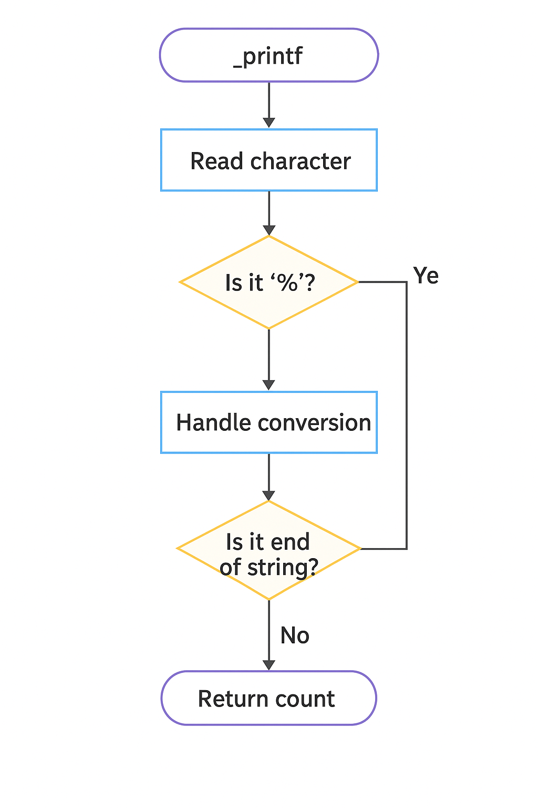

# HOLBERTON SCHOOL — _printf

Recréation partielle de la fonction standard **printf** en C.  
Ce projet implémente une version simplifiée capable de gérer plusieurs formats de base.

## Compilation
gcc -Wall -Wextra -Werror -pedantic -std=gnu89 *.c -o printf

## Exemples d'utilisation
_printf("Character: %c\n", 'H');
_printf("String: %s\n", "Hello Holberton");
_printf("Integer (d): %d\n", -1234);
_printf("Integer (i): %i\n", 42);
_printf("Percent: %%\n");

## Exemples de sortie
Character: H
String: Hello Holberton
Integer (d): -1234
Integer (i): 42
Percent: %

## Format specifiers supportés
%c    Affiche un caractère
%s    Affiche une chaîne
%d    Affiche un entier signé
%i    Identique à %d
%%    Affiche un pourcentage

## Organisation du projet
- _printf.c  — Fonction principale
- print_number.c — Affichage des entiers
- _putchar.c — Écriture d'un caractère
- main.h — Prototypes et includes
- man_3_printf — Page de manuel

## Flowchart

## Auteurs
Sathusan Jeyakumar
Kouakou Janice

